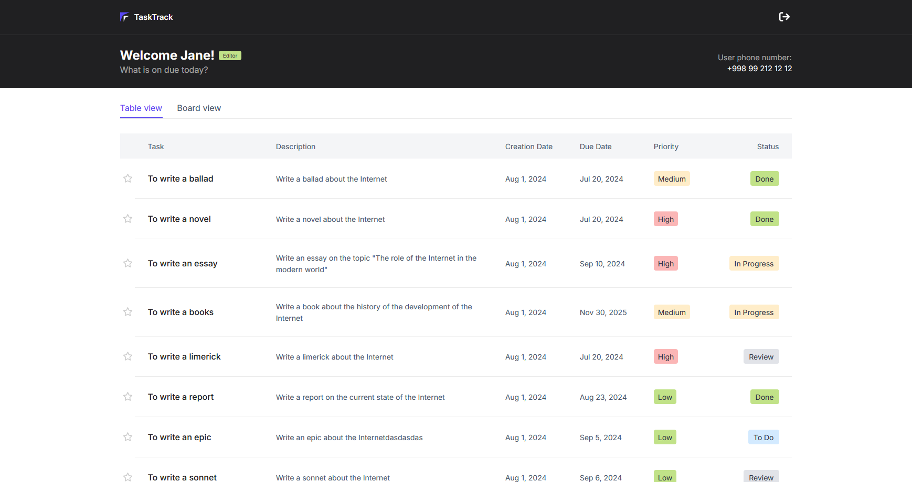
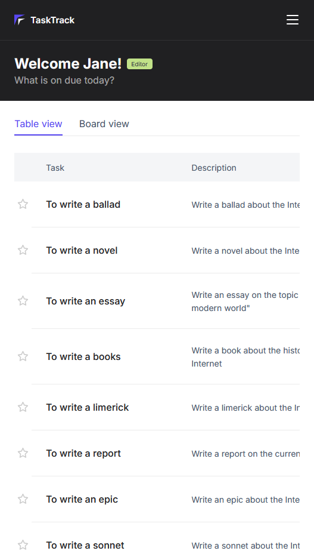
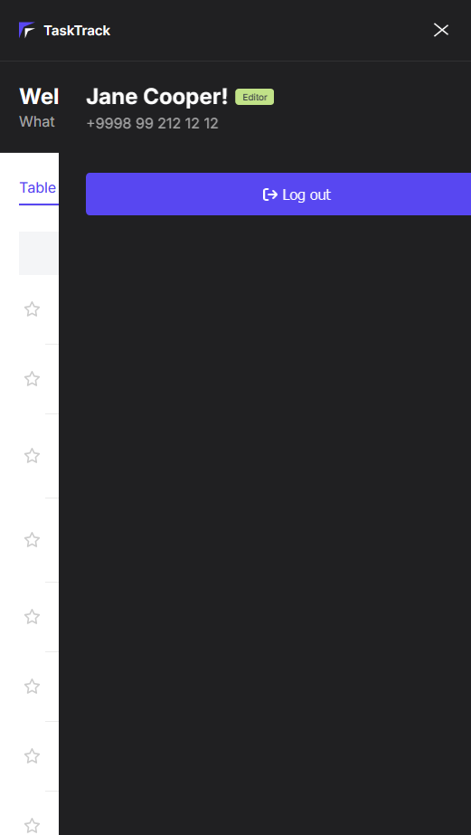
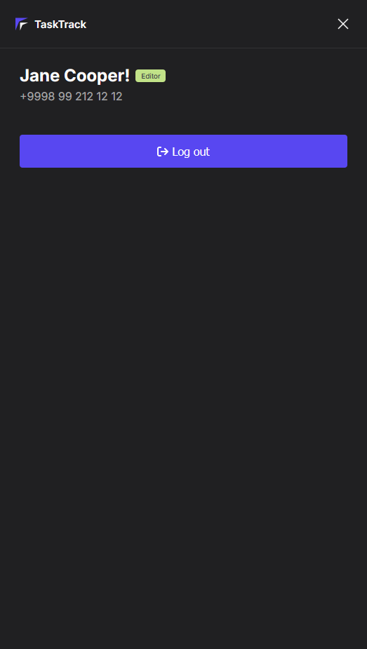
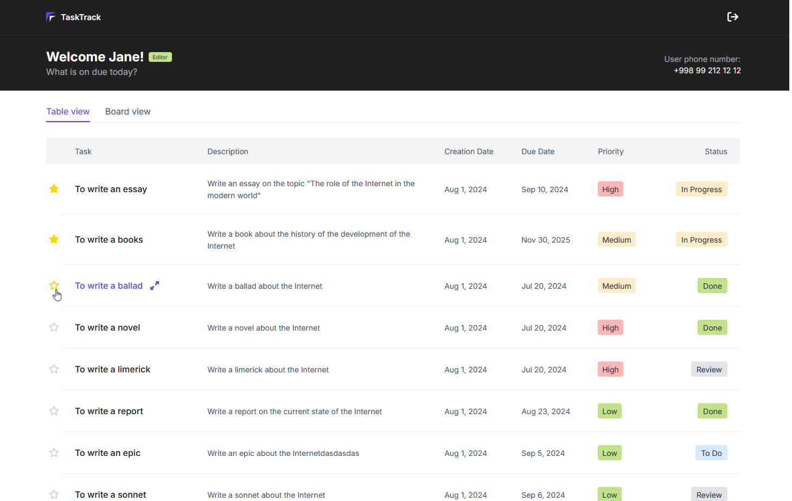
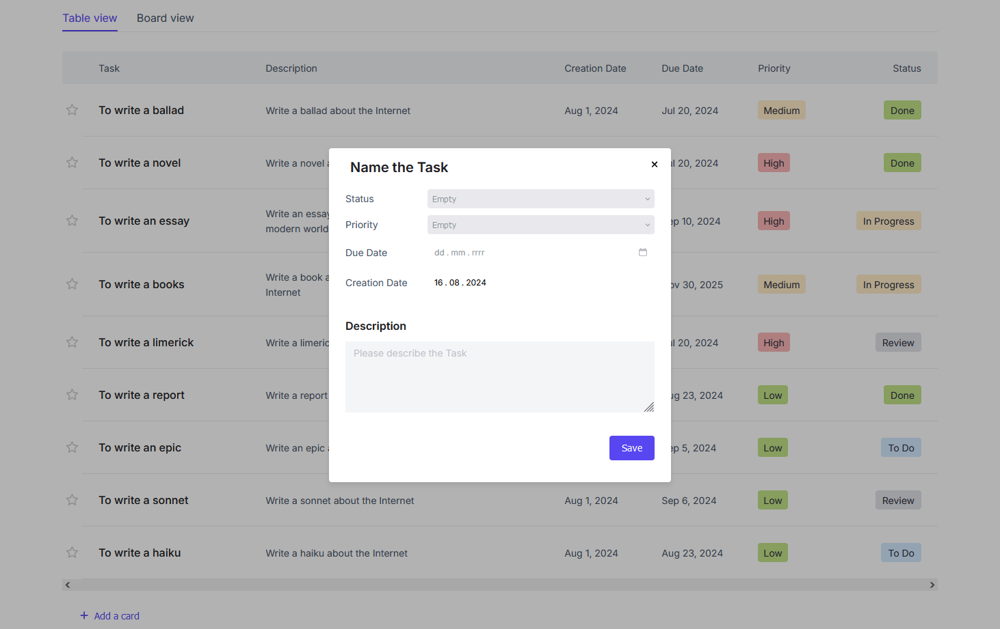
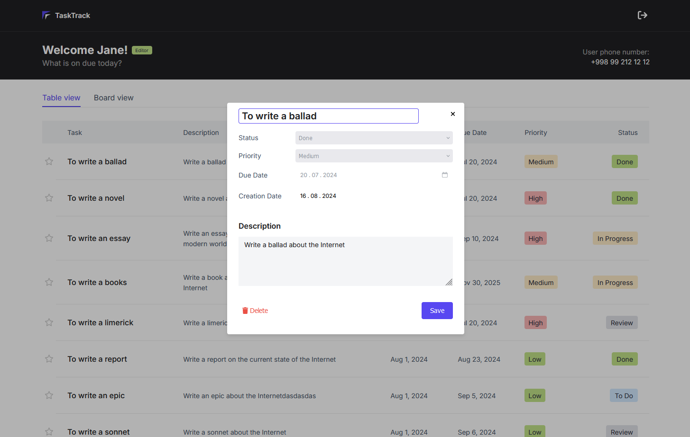
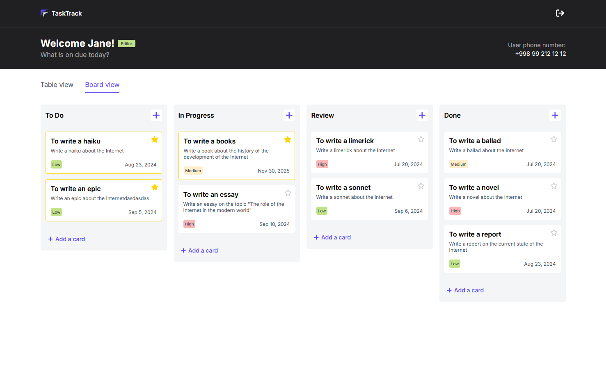
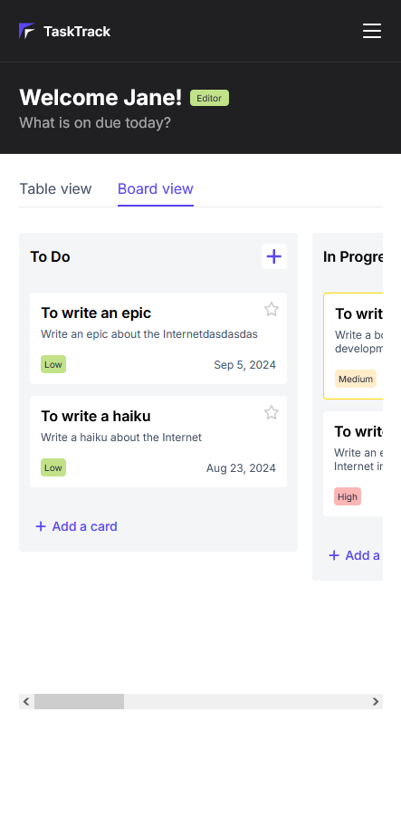
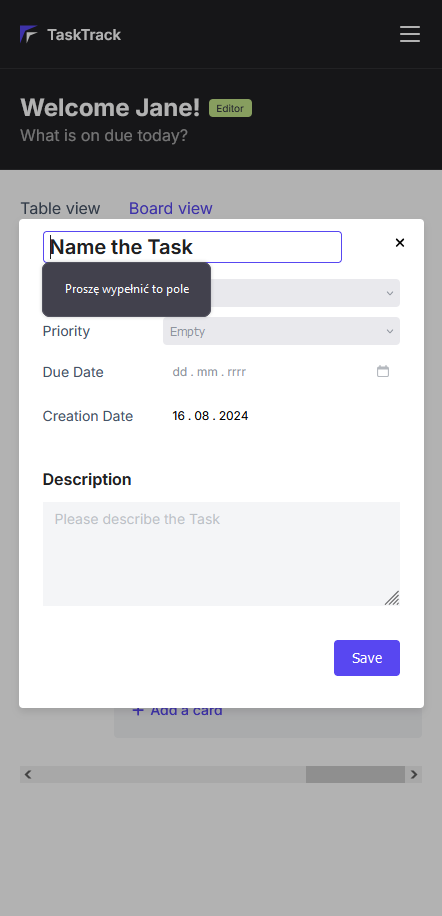

# 🚀 Welcome to Our Awesome Project!

**Note:** This is only the frontend part of the application. It will not function as expected without a backend server.

To run our application, follow these steps:

1. Install the necessary dependencies:

```
npm install
```

2. Run the development server:

```
npm run serve
```

To bundle our application use:

```
npm run build
```

or:

```
yarn build
```

## Table of Contents

- [Overview](#overview)
  - [The Challenge](#the-challenge)
  - [Screenshots](#screenshots)
  - [Links](#links)
- [Process](#process)
  - [Built With](#built-with)
- [Authors](#authors)
- [Acknowledgments](#acknowledgments)

## Overview

### The Challenge

Users should be able to:

- **View a Header**: The header should be responsive and adapt for mobile devices.

- **Interact with a Burger Menu**: The burger menu should include animation for mobile.

- **Access Table and Board Views**: Both views should be responsive and maintain layout integrity across different screen sizes.

- **Select Tasks as Favorite**: Marking a task as a favorite will move it to the top of the list for better visibility.

- **Utilize Modals**: Use modals for creating and updating tasks.

- **Manage User Tasks**:
  - **Create**: Add new tasks in both table and board views.
  - **Update**: Modify existing tasks in both views.
  - **Delete**: Remove tasks from both views.

### Screenshots

#### Header

_Header for desktop:_



_Header for mobile:_



_Burger menu animation:_



_Burger menu:_



#### Table View

_Table view with the ability to select favorite tasks:_



_Create task modal for table view:_



_Update task modal for table view:_



#### Board View

_Board view:_



_Board view for mobile:_



_Create task modal for dashboard view:_



### Links

- [Solution URL: GitLab Repository](https://gitlab.com/Zlata_Kurganskaya/task-manager-client)
- [Live Site URL: Live Demo]

## Process

### Built With

- HTML
- CSS
- JavaScript
- SCSS
- Webpack
- Babel
- Responsive design

## Authors

- Mikołaj Solecki: [GitLab](https://gitlab.com/mikolaj.solecki.123)
- Dmitriy Kim: [GitLab](https://gitlab.com/dmitriy_kim)
- Ibrohim Mirzamukhamedov: [GitLab](https://gitlab.com/resacil)
- Otabek Ortikov: [GitLab](https://gitlab.com/UzOwner)
- Zlata Kurganskaya: [GitLab](https://gitlab.com/Zlata_Kurganskaya)

## Acknowledgments

_ESDE Summer Camp 2024_
